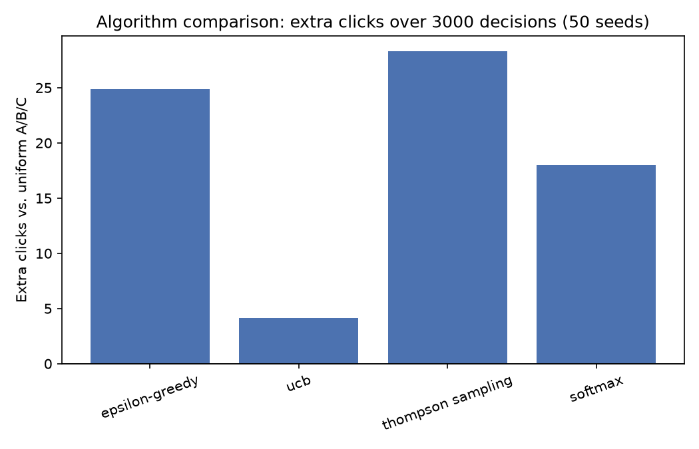
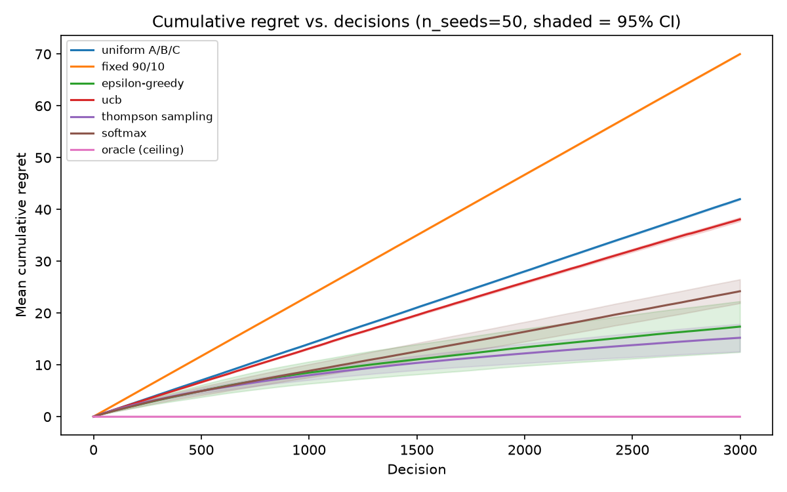
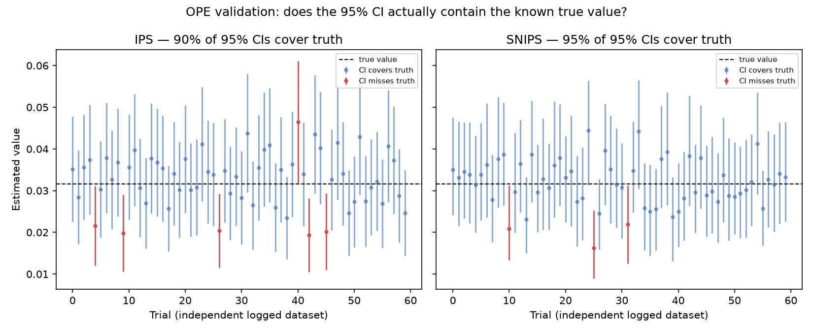
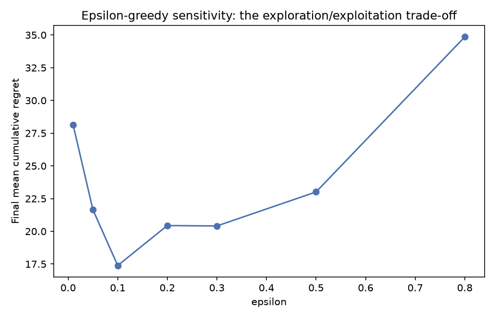
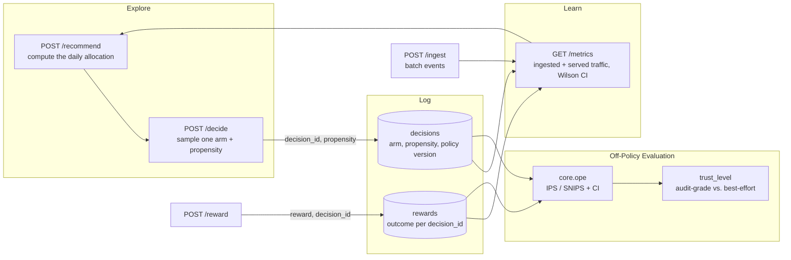

<p align="center">
  
</p>

# Bandit Brain

Decide how to split traffic across the variants of an online experiment using multi-armed bandit algorithms instead of a fixed A/B split. Bandit Brain is a pure Python bandit engine (`core`) with an optional FastAPI service and a Streamlit dashboard on top.

[](https://github.com/tzpereira/bandit-brain/actions/workflows/ci.yml)


---

## Why / when to use it

- **You run ads or landing-page variants and want to shift budget toward winners automatically.** Feed daily impressions/clicks per variant and get a recommended allocation for the next day.
- **You want to compare bandit strategies on your own data.** Four policies (epsilon-greedy, UCB, Thompson sampling, softmax) share one interface, so you can swap them on the same metrics and see how allocation changes.
- **You need the algorithms without the stack.** The `banditbrain.core` package depends only on `numpy` and `pydantic` — import it into your own service, no database or web server required.

---

## Results

All numbers below are measured, not asserted — regenerate them yourself with `make report` (text) and `make figures` (plots), or see [ROADMAP.md](ROADMAP.md) Phase 2 for the methodology. Scenario: a synthetic 3-arm environment with known true CTRs (0.030 / 0.055 / 0.038 — the same values `scripts/generate_example_data.py` uses to build the seeded demo dataset), 3,000 decisions, averaged over 50 seeds.

**Every real policy beats a fixed A/B split, and Thompson Sampling wins:**



| Algorithm | Extra clicks vs. uniform A/B/C | Final regret (95% CI) | % traffic on the true best arm |
|---|---|---|---|
| Thompson Sampling | **+28.28** | 15.24 `[12.58, 17.89]` | 74.3% |
| Epsilon-greedy | +24.90 | 17.39 `[12.48, 22.29]` | 70.8% |
| Softmax | +18.00 | 24.22 `[21.92, 26.52]` | 60.3% |
| UCB | +4.14 | 38.10 `[37.73, 38.47]` | 39.1% |
| Oracle (ceiling, cheats by knowing the truth) | — | 0.00 | 100.0% |
| Uniform A/B/C (baseline) | — | 41.99 `[41.84, 42.15]` | 33.3% |
| Fixed 90/10 toward an arbitrary control arm | worse than uniform | 69.99 `[69.89, 70.09]` | 5.1% |

A fixed split can lose to plain uniform A/B if it happens to favor the wrong variant — a real, sometimes-overlooked failure mode of static "control gets 90%" splits, and the reason adaptive allocation exists.

**Cumulative regret over time** (shaded = 95% CI over seeds) — the sublinear (flattening) curves are what "learning" looks like; the linear ones are what "not learning" looks like:



**Off-policy evaluation recovers the known truth**, not just a plausible-looking number — 60 independent trials, each logging 2,000 decisions under a uniform logging policy and evaluating a fixed 90/10 target policy via IPS/SNIPS, checked against the analytically-exact true value:



| Estimator | True value | Mean bias | 95% CI coverage (target: 95%) |
|---|---|---|---|
| IPS | 0.0316 | +0.00023 | 92.0% |
| SNIPS | 0.0316 | −0.00001 | 92.5% |

**Sensitivity sweep** — epsilon-greedy's `epsilon` traces the textbook exploration/exploitation trade-off (too low: stuck on an early false winner; too high: wastes traffic exploring):



---

## Architecture

The serve → log → learn loop (Phase 1) and the off-policy evaluation it feeds (Phase 2):



`/recommend` computes a batch allocation; `/decide` samples from it per request and logs the decision; `/reward` attributes the outcome; `/metrics` folds served traffic back in for the next `/recommend` call — that's the loop. `core.ope` evaluates logged decisions against a candidate policy independently of the loop, using the same propensities the loop already logs.

---

## Installation

Dependencies are managed with [uv](https://docs.astral.sh/uv/). Source install only — this is a portfolio/learning project, not a published package, and there's no CI step that would publish it. If that changes, it'll be a straightforward `hatchling` build (already configured) pushed via a new CI job; nothing about the current layout blocks it.

```bash
git clone https://github.com/tzpereira/bandit-brain.git
cd bandit-brain

# Core engine only (numpy + pydantic)
uv sync

# Everything (API + dashboard + dev tools)
uv sync --all-extras        # or: make install
```

Optional dependency groups defined in `pyproject.toml`: `api` (FastAPI, uvicorn, psycopg2, PyJWT, bcrypt, Alembic) and `dashboard` (Streamlit, Plotly, Polars).

---

## Quickstart

Use the core engine directly — no server, no database. This runs as-is:

```python
from banditbrain.core.models import Metric
from banditbrain.core.policies import ThompsonSamplingBandit

# One Metric per variant. ctr = clicks / impressions.
metrics = [
    Metric(variant_name="A", impressions=1000, clicks=120, total_cost=1.0,
           device="mobile", location="BRA", user_segment="new_user",
           ctr=0.120, ctr_se=0.010, ctr_ci_lower=0.100, ctr_ci_upper=0.140),
    Metric(variant_name="B", impressions=950, clicks=80, total_cost=0.9,
           device="desktop", location="USA", user_segment="returning_user",
           ctr=0.084, ctr_se=0.009, ctr_ci_lower=0.066, ctr_ci_upper=0.102),
]

bandit = ThompsonSamplingBandit(metrics, experiment_name="homepage_test", date="2026-01-01", seed=0)
for allocation in bandit.get_allocation():
    print(allocation.variant_name, allocation.allocated_pct, allocation.date)
# A 0.9938 2026-01-02
# B 0.0062 2026-01-02
```

Every policy exposes the same `get_allocation()` method, returning a list of `Allocation` objects whose `allocated_pct` values sum to `1.0` — a **fractional** split across every variant, not a winner-take-all pick. The allocation `date` is always the day **after** the input `date` (next-day forecast). Pass `seed=` for reproducible output (required for Thompson Sampling, which samples internally; the other three are already deterministic given the same metrics).

To run the full stack instead (API + dashboard + PostgreSQL):

```bash
cp .env.example .env
docker compose up --build      # or: make up
make seed                      # optional: load demo data
```

- API: <http://localhost:8000> (OpenAPI docs at `/docs`)
- Dashboard: <http://localhost:8501>

---

## Core concepts: the four policies

All four take a `list[Metric]` and produce a `list[Allocation]` — a **fractional** distribution over every variant that sums to `1.0`, reproducible given the same metrics (and a `seed=` for Thompson Sampling). They differ in how they turn observed click-through rates (CTR) into that distribution.

| Strategy | Class | Tuning param | Choose it when |
|---|---|---|---|
| Epsilon-greedy | `EpsilonGreedyBandit` | `epsilon` (0–1, default 0.1) | You want the simplest exploration/exploitation knob. |
| UCB | `UCBBandit` | `c` (>0, default 2.0) | You want exploration driven by uncertainty, not a fixed rate. |
| Thompson sampling | `ThompsonSamplingBandit` | — (optional `priors`) | Data is sparse/uncertain and you want a Bayesian approach. |
| Softmax | `SoftmaxBandit` | `tau` (>0, default 0.1) | You want every variant's share to move smoothly with its CTR. |

**Epsilon-greedy.** Gives `(1 − epsilon)` to the empirical best CTR and spreads `epsilon` uniformly (`epsilon / K` each) across every variant — deterministic given the metrics. Ties for best split the exploitation share equally.

**UCB (Upper Confidence Bound).** Scores each variant as `ctr + c * sqrt(ln(total_impressions) / impressions)`; the top score gets `(1 − exploration_floor)`, with `exploration_floor` spread uniformly as an exploration floor. Never-shown variants get an infinite (maximally optimistic) score, so they're explored first. `c` controls how aggressively it explores.

**Thompson sampling.** Estimates `P(variant is best)` via Monte Carlo (10k draws by default) over each variant's `Beta(alpha + clicks, beta + impressions − clicks)` posterior and allocates proportionally to that probability — not a single stochastic pick. Pass `priors={"A": (alpha, beta)}` to seed a variant's posterior from history (e.g. a prior experiment) instead of the uninformative `Beta(1, 1)`, so a known-good variant starts ahead of 50/50.

**Softmax.** Converts CTRs into a probability distribution with a numerically stable softmax at temperature `tau`: `p_i = exp(ctr_i / tau) / Σ_j exp(ctr_j / tau)`. Low `tau` → close to greedy; high `tau` → close to uniform.

**Bias controls (all four).** Every constructor also accepts `min_allocation`/`max_allocation` (floor/cap every variant must respect, default `0.0`/`1.0`) and `champion`/`champion_min_allocation` (guarantee an incumbent variant a minimum share while challengers are explored). These are applied *after* the policy computes its raw preference, via a water-filling projection that preserves relative preference among the unconstrained variants — see `project_to_floor_cap` in `core/policies.py`.

---

## API reference (`banditbrain.core`)

### Policies

Every constructor takes `metrics: list[Metric]`, plus keyword-only `experiment_name: str = ""`, `date: str | None = None` (stamps the output; `None`/`""` means today), `seed: int | None = None`, and the bias-control kwargs (`min_allocation`, `max_allocation`, `champion`, `champion_min_allocation`). `get_allocation()` returns `list[Allocation]`; `allocate()` returns the raw `numpy.ndarray` distribution before bias controls are applied.

```python
EpsilonGreedyBandit(metrics, epsilon=0.1, *, experiment_name="", date=None, seed=None, **bias_controls)
UCBBandit(metrics, c=2.0, *, exploration_floor=0.1, experiment_name="", date=None, seed=None, **bias_controls)
ThompsonSamplingBandit(metrics, *, n_samples=10_000, priors=None, experiment_name="", date=None, seed=None, **bias_controls)
SoftmaxBandit(metrics, tau=0.1, *, experiment_name="", date=None, seed=None, **bias_controls)
```

```python
from banditbrain.core.policies import ThompsonSamplingBandit

# Protect a losing incumbent at 20% while a new challenger seeded with strong
# prior history (80% historical CTR) competes for the rest.
bandit = ThompsonSamplingBandit(
    metrics,
    seed=0,
    champion="B", champion_min_allocation=0.2,
    priors={"A": (800.0, 200.0)},
)
allocations = bandit.get_allocation()   # -> [Allocation(...), ...], sums to 1.0
```

### Sampling a single decision (`banditbrain.core.decide`)

`sample_decision` draws one arm from a stored `Allocation` batch and reports its propensity — the "Rank" half of the serve/log/learn loop the HTTP API's `/decide` endpoint runs on.

```python
from banditbrain.core.decide import sample_decision

variant_name, propensity = sample_decision(allocations)   # propensity = P(chosen arm | state)
```

### CTR statistics (`banditbrain.core.stats`)

```python
from banditbrain.core.stats import wilson_score_interval, standard_error

wilson_score_interval(clicks=120, impressions=1000)   # -> (ci_lower, ci_upper)
wilson_score_interval(clicks=0, impressions=0)        # -> (0.0, 1.0), not a false (0.0, 0.0)
```

Used instead of the normal approximation because it stays well-behaved for zero clicks and is defined at zero impressions — see [ROADMAP.md](ROADMAP.md) Phase 1.3.

### Models (`banditbrain.core.models`)

Pydantic models used across the engine.

- **`Metric`** — one variant's aggregated stats: `variant_name`, `clicks`, `impressions`, `total_cost`, `device`, `location`, `user_segment`, `ctr`, `ctr_se`, `ctr_ci_lower`, `ctr_ci_upper`, plus optional `cpc`/`cpv`. This is the input to every policy.
- **`Allocation`** — one variant's recommended share: `experiment_name`, `variant_name`, `allocated_pct`, `algorithm` (`"eg"`, `"ucb"`, `"ts"`, `"softmax"`), `params` (the policy's hyperparameters for this batch — its "version"), `date`. The output of every policy.
- **`Decision`** — one served decision: `decision_id`, `experiment_name`, `variant_name`, `propensity`, `decision_source` (`"served"` | `"byo"`), `algorithm`, `policy_params`, `allocation_date`. Logged by `POST /decide`.
- **`Reward`** — an outcome attributed to a decision: `decision_id`, `reward` (binary, `0.0`/`1.0`). Logged by `POST /reward`.
- **`Experiment`** — a raw ingested event: `experiment_name`, `variant_name`, `impressions`, `clicks`, `cost`, `event_date`, optional `context`.

### Helper (`banditbrain.core.dates`)

```python
from banditbrain.core.dates import get_prediction_date

get_prediction_date("2026-01-01")   # -> "2026-01-02"  (always +1 day)
get_prediction_date(None)           # -> tomorrow's date, ISO format
```

---

## HTTP API (`banditbrain.api`)

The FastAPI service wraps the core engine, persists to PostgreSQL, and gates everything behind JWT auth. All routes except `/signup` and `/login` require an `Authorization: Bearer <token>` header.

| Method | Path | Purpose |
|---|---|---|
| POST | `/signup` | Create an account (`email`, `password`). |
| POST | `/login` | Exchange credentials for a JWT access token. |
| POST | `/ingest` | Ingest a JSON **array** of experiment events (batch). |
| POST | `/recommend` | Run a policy over stored metrics and persist + return the day's allocation batch. |
| POST | `/decide` | Sample one arm from the latest allocation batch; logs the decision (propensity, policy version, provenance). |
| POST | `/reward` | Attribute a binary outcome to a `decision_id` logged by `/decide`. |
| GET | `/experiments` | List ingested events. Filters: `experiment_name`, `date`, `limit`. |
| GET | `/metrics` | Aggregated per-variant metrics — folds in served `/decide` + `/reward` traffic alongside ingested data. Filters: `experiment_name`, `date`, `group_by_context`. |
| GET | `/allocations` | List persisted allocations. Filters: `experiment_name`, `date`, `algorithm`, `limit`. |
| DELETE | `/experiments` | Delete the caller's experiment records (204, no payload). |
| DELETE | `/allocations` | Delete the caller's allocation records (204, no payload). |

`/recommend` and `/decide` together are the **serve → log → learn loop**: `/recommend` computes a batch allocation once (e.g. daily); `/decide` samples from it per-request and logs the decision; `/reward` reports the outcome; the next `/recommend` call sees that served traffic in its metrics. See [ROADMAP.md](ROADMAP.md) Phase 1.2 for the design rationale.

**`POST /recommend` body** — `method` selects the policy; only the matching param is used. Bias-control and `priors` fields are all optional:

```json
{
  "experiment_name": "homepage_test",
  "method": "ts",
  "epsilon": 0.1,
  "c": 2.0,
  "tau": 0.1,
  "date": "2026-01-01",
  "min_allocation": 0.05,
  "max_allocation": 0.9,
  "champion": "A",
  "champion_min_allocation": 0.2,
  "priors": {"B": [800.0, 200.0]}
}
```

Validation: `method` ∈ `{eg, ucb, ts, softmax}`, `epsilon` ∈ `[0, 1]`, `c`/`tau` ≥ 0, `min_allocation`/`max_allocation`/`champion_min_allocation` ∈ `[0, 1]` with `min_allocation ≤ max_allocation`. The response is a list of `Allocation` objects dated the next day. Interactive docs are served at `/docs`.

**`POST /decide` body / response:**

```json
// request
{"experiment_name": "homepage_test", "algorithm": "ts"}

// response
{
  "decision_id": "b4aaedfd-2940-4080-981e-111723fbf319",
  "experiment_name": "homepage_test",
  "variant_name": "A",
  "propensity": 0.92,
  "decision_source": "served",
  "algorithm": "ts",
  "policy_params": {"n_samples": 10000, "priors": {}},
  "allocation_date": "2026-01-02"
}
```

Returns 404 if no allocation batch exists yet for that experiment/algorithm (call `/recommend` first). Latency budget: p99 < 50ms — it samples from an already-computed allocation rather than recomputing a policy per request (measured locally: p50 8.5ms / p95 13.4ms / p99 14.5ms over 200 requests).

**`POST /reward` body:**

```json
{"decision_id": "b4aaedfd-2940-4080-981e-111723fbf319", "reward": 1.0}
```

`reward` must be `0.0` or `1.0` (click-equivalent; continuous/monetary reward is out of scope, see [ROADMAP.md](ROADMAP.md) non-goals). Returns 404 for an unknown `decision_id`, 409 if that decision already has a reward recorded — at most one reward per decision.

**`POST /ingest` body** — an array; `clicks` must not exceed `impressions`:

```json
[
  {
    "experiment_name": "homepage_test",
    "variant_name": "A",
    "impressions": 1000,
    "clicks": 120,
    "cost": 1.0,
    "event_date": "2026-01-01",
    "context": {"device": "mobile"}
  }
]
```

A ready-to-import request collection lives in [routes-collection/bandit-brain-routes.har](routes-collection/bandit-brain-routes.har).

### Dashboard CSV format

The Streamlit dashboard can upload real data instead of using the API. Expected columns (see [public/example_ads_data.csv](public/example_ads_data.csv)):

`variant_name, impressions, clicks, cost, device, location, user_segment, hour`

---

## Configuration

The API and dashboard read the following environment variables (see [.env.example](.env.example)):

| Variable | Used by | Description |
|---|---|---|
| `DATABASE_URL` | API | PostgreSQL connection string. |
| `HASH_SECRET_KEY` | API | Secret for signing JWTs. |
| `HASH_ALGORITHM` | API | JWT algorithm (e.g. `HS256`). |
| `HASH_TOKEN_EXPIRE_MINUTES` | API | Token lifetime in minutes. |
| `POSTGRES_USER` / `POSTGRES_PASSWORD` / `POSTGRES_DB` | db | PostgreSQL bootstrap credentials. |
| `API_URL` | dashboard | Base URL the dashboard calls. |

**Policy hyperparameters** are passed per request/call, not via env:

| Param | Policy | Range | Default | Effect |
|---|---|---|---|---|
| `epsilon` | epsilon-greedy | `[0, 1]` | `0.1` | Higher → more random exploration. |
| `c` | UCB | `> 0` | `2.0` | Higher → more weight on uncertainty (more exploration). |
| `tau` | softmax | `> 0` | `0.1` | Higher → more uniform; lower → greedier. |

Database schema changes are managed with Alembic ([migrations/](migrations/)) and applied automatically when the API container starts; run them manually with `make migrate` (needs `DATABASE_URL`).

---

## Development

```bash
make install     # uv sync --all-extras
make test        # uv run pytest
make coverage    # pytest --cov=banditbrain.core (currently 97%)
make lint        # ruff check + format --check
make typecheck   # mypy on banditbrain.core
make check       # lint + typecheck + test
make seed        # load demo data into a running stack
make report      # print the Phase 2 headline numbers (regret, OPE validation, sensitivity)
make figures     # regenerate every plot in the Results section (public/figures/)
```

Tests live in [tests/](tests/): `test_core_policies.py` / `test_core_policies_properties.py` (allocation correctness, incl. hypothesis property tests), `test_core_bias_controls.py` (floor/cap/champion), `test_core_stats.py` (Wilson score CI), `test_core_decide.py` (decision sampling), `test_core_ope.py` (IPS/SNIPS), `test_simulation_*.py` (environment, baselines, runner, OPE validation, sensitivity sweeps), `test_ingest_validation.py` / `test_decide_reward_validation.py` / `test_recommend_validation.py` (request validation), `test_api_smoke.py` (routes registered + auth enforced). CI runs lint → typecheck → tests on every push and PR ([.github/workflows/ci.yml](.github/workflows/ci.yml)); `pre-commit` hooks mirror it.

### Project layout

```
src/banditbrain/
  core/          # Pure bandit engine: policies, OPE, stats, models (numpy + pydantic only)
  api/           # FastAPI layer: routes, repositories, JWT auth, validators
  simulation/    # Synthetic environment, baselines, runner, OPE validation, sensitivity sweeps
dashboard/       # Streamlit dashboard
migrations/      # Alembic migrations
docker/          # Dockerfiles + entrypoints
scripts/         # Seed, example-data, simulation report + figure generation
tests/           # pytest suite
```

The project's direction is tracked in [ROADMAP.md](ROADMAP.md).

---

## Contributing

Issues and pull requests are welcome. Please run `make check` before opening a PR so lint, types, and tests stay green.

## License

MIT — see [LICENSE](LICENSE).
